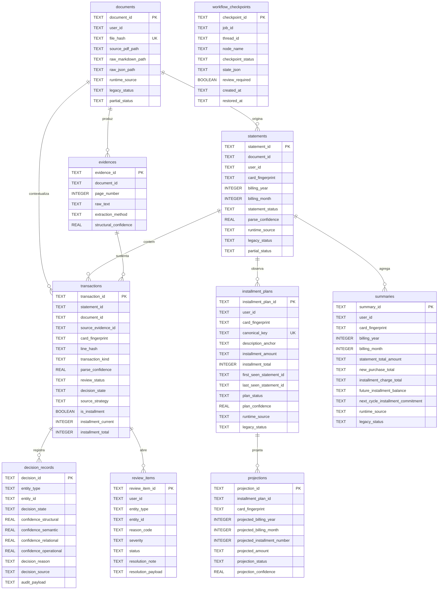

# Schema do Banco

Este projeto usa SQLite e inicializa o schema em [src/faturama/infrastructure/database/schema.py](/Users/mferovante/Documents/faturama/src/faturama/infrastructure/database/schema.py:1).

## Visão geral

- Base canônica principal:
  `FATURAMA_DB_PATH`, padrão `data/faturama.sqlite3`
- Base de checkpoints do workflow:
  `FATURAMA_CHECKPOINT_DB_PATH`, padrão `data/faturama-checkpoints.sqlite3`
- O schema é criado por `initialize_schema(...)`.
- O projeto não declara `FOREIGN KEY` no SQLite; a integridade entre tabelas é mantida pela aplicação.
- Registros antigos fora do runtime oficial são marcados como `legacy_status='invalidated'` e ficam fora das consultas.

## Fluxo resumido

1. O PDF processado gera um registro em `documents`.
2. A fatura consolidada daquele documento gera um registro em `statements`.
3. Cada linha de compra/pagamento gera um registro em `transactions`.
4. Linhas parceladas geram ou atualizam `installment_plans` e `projections`.
5. A competência mensal agregada gera ou atualiza `summaries`.
6. Evidências textuais vão para `evidences`.
7. Decisões automáticas ou humanas vão para `decision_records`.
8. Casos pendentes de revisão vão para `review_items`.
9. O workflow do `LangGraph` persiste snapshots em `workflow_checkpoints`.

## Tabelas

### `documents`

Função:
Registrar a identidade do arquivo PDF processado e os artefatos brutos associados ao documento.

Uso operacional:
- escrita por `StatementRepository.save_document(...)`
- leitura por `StatementRepository.get_document_by_hash(...)`
- usada para idempotência via `file_hash`

Colunas-chave:
- `document_id`: identificador canônico do documento
- `file_hash`: hash SHA-256 do PDF, único
- `source_pdf_path`: caminho do PDF de origem
- `raw_markdown_path`, `raw_json_path`: artefatos gerados/reutilizados pelo runtime
- `runtime_source`: `official` ou `legacy`
- `legacy_status`: controla se o histórico pode ser consultado
- `partial_status`: indica se a ingestão ficou parcial

### `statements`

Função:
Representar a fatura já interpretada para uma competência e um cartão.

Uso operacional:
- escrita por `StatementRepository.save_statement(...)`
- leitura por `list_statements`, `get_statement` e `list_statements_filtered`
- usada como base para consultas por mês e cartão

Colunas-chave:
- `statement_id`: identificador da fatura
- `document_id`: documento de origem
- `card_fingerprint`: identidade estável do cartão
- `billing_year`, `billing_month`: competência da fatura
- `statement_status`: estado da fatura, como `parsed` ou `partial`
- `parse_confidence`: confiança estrutural geral
- `runtime_source`, `legacy_status`, `partial_status`: governança de validade operacional

### `evidences`

Função:
Guardar o trecho bruto extraído que sustenta uma linha ou decisão do pipeline.

Uso operacional:
- escrita por `EvidenceRepository.save_evidence(...)`
- vinculada a `transactions.source_evidence_id`

Colunas-chave:
- `evidence_id`: identificador da evidência
- `document_id`: documento de origem
- `raw_text`: trecho bruto observado
- `page_number`: página onde o trecho apareceu
- `extraction_method`: método usado para extrair
- `structural_confidence`: confiança da extração estrutural

### `transactions`

Função:
Persistir cada lançamento canônico da fatura, já classificado e com metadados de decisão.

Uso operacional:
- escrita por `TransactionRepository.save_transaction(...)`
- leitura por `list_by_statement`, `list_by_month` e `find_by_line_hash`
- base de consultas de compras, parcelas observadas e revisão

Colunas-chave:
- `transaction_id`: identificador da transação
- `statement_id`, `document_id`: vínculos de origem
- `line_hash`: chave estável da linha dentro da fatura
- `transaction_kind`: tipo operacional da linha
- `review_status`: situação da revisão
- `decision_state`: resultado da política de decisão
- `source_evidence_id`: evidência principal
- `source_strategy`: `rule`, `ai_agent` ou equivalente
- `is_installment`, `installment_current`, `installment_total`: semântica de parcelamento

Observação:
- há `UNIQUE(statement_id, line_hash)` para evitar duplicação no reprocessamento

### `installment_plans`

Função:
Consolidar uma compra parcelada como entidade de longo prazo, atravessando múltiplas faturas.

Uso operacional:
- escrita por `InstallmentRepository.save_plan(...)`
- leitura por `InstallmentRepository.list_plans(...)`
- usada para saldo restante e projeções futuras

Colunas-chave:
- `installment_plan_id`: identificador do plano parcelado
- `canonical_key`: chave única da compra parcelada
- `description_anchor`, `description_normalized`, `merchant_normalized`: identidade semântica do parcelamento
- `installment_amount`, `installment_total`: contrato financeiro do plano
- `first_seen_statement_id`, `last_seen_statement_id`: janela observada do plano
- `plan_status`, `plan_confidence`, `matching_strategy`: governança do matching
- `runtime_source`, `legacy_status`: validade operacional

### `projections`

Função:
Persistir as parcelas futuras projetadas de cada `installment_plan`.

Uso operacional:
- regravada por `InstallmentRepository.save_projections(...)`
- lida por `InstallmentRepository.list_projections(...)`
- usada por queries de parcelas futuras e saldo restante

Colunas-chave:
- `projection_id`: identificador da projeção
- `installment_plan_id`: plano ao qual pertence
- `projected_billing_year`, `projected_billing_month`: competência futura
- `projected_installment_number`: número da parcela projetada
- `projected_amount`: valor futuro esperado
- `projection_status`, `projection_confidence`: governança da projeção

Observação:
- há unicidade por plano + competência + número da parcela

### `summaries`

Função:
Materializar um read model mensal por cartão para consultas rápidas.

Uso operacional:
- escrita por `SummaryRepository.upsert_summary(...)`
- leitura por `SummaryRepository.list_summaries(...)`
- usada pela query `monthly_spend`

Colunas-chave:
- `summary_id`: identificador do resumo
- `user_id`, `card_fingerprint`, `billing_year`, `billing_month`: chave funcional do resumo
- `statement_total_amount`: total da fatura
- `new_purchase_total`: compras novas
- `installment_charge_total`: parcelas cobradas no mês
- `future_installment_balance`: saldo futuro total projetado
- `next_cycle_installment_commitment`: compromisso do próximo ciclo
- `runtime_source`, `legacy_status`: governança de validade

Observação:
- há `UNIQUE(user_id, card_fingerprint, billing_year, billing_month)`

### `review_items`

Função:
Representar pendências operacionais abertas para revisão humana.

Uso operacional:
- escrita por `ReviewRepository.save_review_item(...)`
- listada por `review-queue`
- resolvida por `ReviewRepository.resolve_review_item(...)`
- reutilizada no reprocessamento para não reabrir a mesma pendência resolvida

Colunas-chave:
- `review_item_id`: identificador da pendência
- `entity_type`, `entity_id`: entidade sob revisão
- `reason_code`, `reason_detail`: motivo da revisão
- `confidence_threshold_snapshot`: limiar usado na hora da decisão
- `severity`: severidade operacional
- `status`: `open` ou `resolved`
- `resolution_note`, `resolution_payload`: decisão humana persistida

### `decision_records`

Função:
Persistir a trilha auditável de decisões tomadas no pipeline.

Uso operacional:
- escrita por `DecisionRepository.save_decision(...)`
- leitura por `DecisionRepository.list_decisions(...)`
- cobre decisões de regra, agente e revisão reaplicada

Colunas-chave:
- `decision_id`: identificador da decisão
- `entity_type`, `entity_id`: alvo da decisão
- `decision_state`: estado final da decisão
- `confidence_structural`, `confidence_semantic`, `confidence_relational`, `confidence_operational`: dimensões de confiança
- `decision_reason`: justificativa textual
- `decision_source`: origem da decisão, como `rule`, `ai_agent` ou `human_review`
- `audit_payload`: JSON com evidências complementares

### `workflow_checkpoints`

Função:
Persistir snapshots do estado do workflow oficial executado com `LangGraph`.

Uso operacional:
- escrita por `SQLiteCheckpointStore.save(...)`
- leitura por `SQLiteCheckpointStore.latest(...)`
- atualização por `SQLiteCheckpointStore.mark_restored(...)`
- também pode coexistir com o checkpointer oficial `SqliteSaver` do `LangGraph`

Colunas-chave:
- `checkpoint_id`: identificador do checkpoint
- `job_id`: execução de ingestão
- `thread_id`: thread lógica do workflow
- `node_name`: nó do workflow que gerou o snapshot
- `checkpoint_status`: estado do checkpoint
- `state_json`: payload serializado do estado completo
- `review_required`: flag para pausa operacional
- `created_at`, `restored_at`: trilha temporal

## Relações lógicas

- `documents` 1:N `statements`
- `documents` 1:N `evidences`
- `statements` 1:N `transactions`
- `transactions` N:1 `evidences` via `source_evidence_id`
- `installment_plans` 1:N `projections`
- `transactions` e outras entidades 1:N `decision_records`
- `transactions` e outras entidades 1:N `review_items`
- `workflow_checkpoints` pertence a um `job_id`, não a uma entidade canônica

## Diagrama ER

## Regras importantes de negócio refletidas no schema

- `file_hash` em `documents` sustenta idempotência por PDF.
- `line_hash` em `transactions` evita duplicar linhas no reprocessamento.
- `canonical_key` em `installment_plans` evita duplicar o mesmo parcelamento entre ciclos.
- `legacy_status='invalidated'` bloqueia o uso operacional de dados antigos fora do runtime oficial.
- `partial_status` permite persistência auditável mesmo quando a ingestão não fechou 100%.

## Onde consultar no código

- schema: [src/faturama/infrastructure/database/schema.py](/Users/mferovante/Documents/faturama/src/faturama/infrastructure/database/schema.py:1)
- conexão SQLite: [src/faturama/infrastructure/database/sqlite.py](/Users/mferovante/Documents/faturama/src/faturama/infrastructure/database/sqlite.py:1)
- repositórios: [src/faturama/infrastructure/repositories](/Users/mferovante/Documents/faturama/src/faturama/infrastructure/repositories)
- workflow oficial: [src/faturama/application/use_cases/process_invoice.py](/Users/mferovante/Documents/faturama/src/faturama/application/use_cases/process_invoice.py:1)
